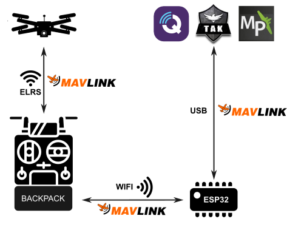
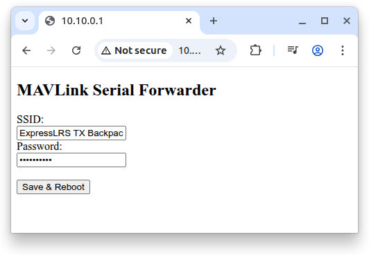
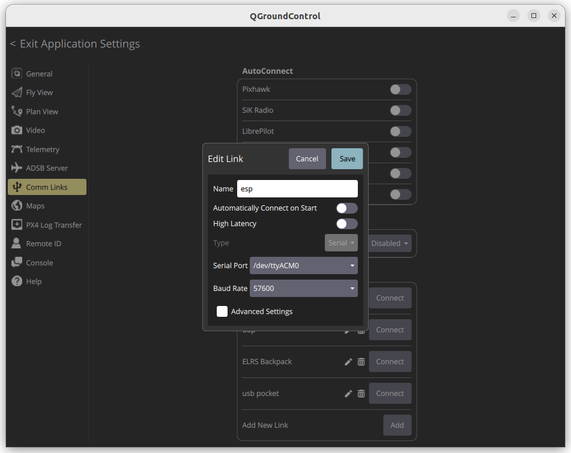
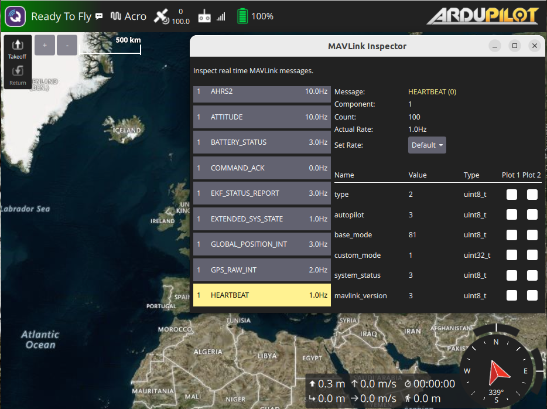

# MAVLink ELRS Backpack TX <-> Serial Forwarder (ESP32)

A MAVLink packet forwarder bridging ExpressLRS Backpack TX and a serial port (USB), built on the ESP32 platform. This project enables MAVLink packet forwarding between the ELRS TX Backpack and a serial port in both directions using internal built-in ELRS module.

It allows you to connect a UAV to a GCS via USB using the MAVLink protocol. This may be helpful when a WiFi connection is not suitable (multiple UAV connections,the GCS device lacks WiFi support, etc.).

## Hardware Requirements

- ESP32-based development board (e.g., ESP32 DevKit, TTGO T-Beam, etc.)
- ExpressLRS TX device with Backpack functionality (with an ELRS internal module)
- Flight controller firmware with bidirectional MAVLink support (Command and Control, e.g., ArduPilot)

## ExpressLRS TX Configuration

Enable MAVLink communication on your RC device and flight controller (FC) as described here:  
[ExpressLRS MAVLink](https://www.expresslrs.org/software/mavlink/). 

To enable the MAVLink protocol on the TX Backpack WiFi, follow the  
["WiFi Connectivity"](https://www.expresslrs.org/software/mavlink/#wifi-connectivity) guide.

To test the connection, connect to the Backpack WiFi network and launch a GCS application (e.g., Mission Planner or QGroundControl). Select a UDP connection on port 14550. You should be able to receive telemetry data from the UAV and send commands to it (e.g., ARM/DISARM).

## ESP32 Setup

1. Clone the repo.  
2. Build and upload the software to the ESP32 device ([guide](https://docs.platformio.org/en/stable/tutorials/espressif32/arduino_debugging_unit_testing.html#compiling-and-uploading-the-firmware)).  
3. Make sure that the Backpack TX WiFi network is enabled.  
4. About 30 seconds after upload, the device should start a WiFi access point (SSID: `MAVLink Serial Forwarder`, password: `mavlink123`). Connect to it and open `10.10.0.1` in your browser.  
5. Configure the Backpack SSID (e.g., `ExpressLRS TX Backpack xxx`, where `xxx` is part of your UID) and password (usually `expresslrs`).  
   
6. Click `Save & Reboot`.  
7. The device will reboot. If the WiFi connection to the Backpack is successful, the LED will start blinking.  
8. The device is ready to be connected to the GCS. Use USB as the connection type in your GCS.  

  

## ESP32 LED Status

| LED Status | Meaning                                                                                             |
|------------|-----------------------------------------------------------------------------------------------------|
| None       | The device is initializing                                                                          |
| Stable     | The device was unable to connect to the Backpack and is waiting for configuration via web interface |
| Blinking   | The device is connected to the Backpack and is forwarding MAVLink packets                           |
